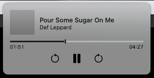
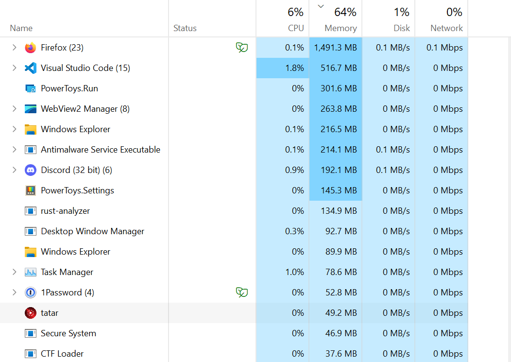

<h1 align="center">
     
    tatar
</h1>

<h4 align="center">
    A youtube music client built with tauri.
</h4>

## Download
You can download executables from [releases]("https://github.com/2gn/tatar/releases")

## Contributions
Feel free to create some issues. I'll try my best to make the situation better.

Pull requests are welcome. Please send some.

## Screenshots

## FAQ

### I cannot quit the app
On windows, from the system tray, right-click on the tatar icon and select `Quit`

On MacOS, I don't know (I don't have MacOS to test this on, sorry). Open Activity Monitor, find tatar and quit it.
